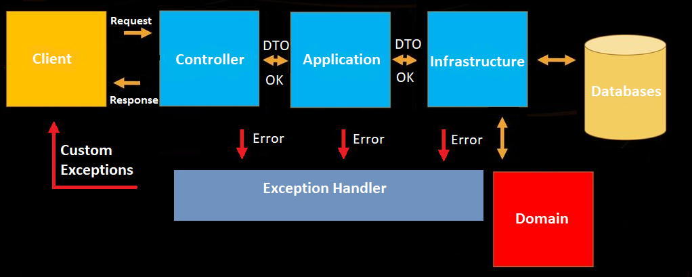
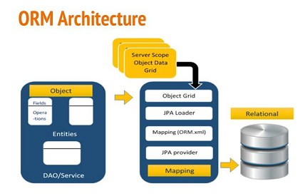

<p style="text-align: center;"> Arias Jiménez, Carlos  </p>

# Pizza-Shop Backend

This document provided a brief introduction to the concepts required to properly understand and develop a Backend in Spring Boot. The Backend has been developed in the CapGemini Bootcamp, comprising the first six weeks of it. The development took place under the Spring Boot framework, which allows the developers to:

- Avoid heavy XML configurations in Spring.
- Easy maintenance and creation of REST endpoints.
- Easy deployment and scalability.

 The architecture used is represented in the following diagram:

 

 where the onion architecture layers can be seen. Apart from the usual layers that will be explained in detail later, an exception handler has been introduced as a novelty.

 This part of our application will catch the errors that are produced inside our system and provide the client useful errors, saving the developer-savvy information in a log file and not exposing it outside, adding an extra layer of security.

 Since this is a project built on Java, Maven has been employed as a build and dependency management tool. Tomcat will be used as HTTP web server, and Postman as a tool to provide the requests to our controller layer.

 ## **Architecture layers.**

 In this section the layers appearing on the previous diagram will be expanded upon.

 ### **Domain layer.**

 The most crucial part of our backend, here will be the entities that later will be persisted via the infrastructure layer. In this particular case, the domain will contain the ingredient entity, user entity, comment entity, pizza entity and the corresponding interfaces to implement later in the infrastructure layer. The interfaces will be segregated to comply with the **SOLID principles**.
 
 All of the previous entities have been extended from a main abstract class, called *EntityBase* that contains the main method of identification of our implementation, the UUID (universally unique identifier) as id, and several methods which purpose will be detailed later. This EntityBase class is stored at the core folder, to separate it from the domain. The remaining content of the core folder will also be detailed in the next sections. Take into account the @MappedSuperClass, this annotation is used when the class can be mapped in the same way as an entity except that the mappings will apply only to its subclasses since no table exists for the mapped superclass itself.

 It should be noted that the domain ***must remain pure*** (annotation-free), but for the sake of simplicity the entities will be annotated to validate them at the application layer. The annotation @Entity will denote the name to refer to the entities on the queries later.

### **Infrastructure layer.**

This layer's function is to access the domain entities via the already defined interfaces, and persist them on the physical media of choice (in our case, a MySQL database running on a *docker container*). To fulfil this, the project uses JPA, or [Java persistance API](https://docs.spring.io/spring-data/jpa/docs/current/reference/html/#preface). 

Two classes per entity are implemented in this layer:

#### EntityRepositoryImp.java 
 Implements the interfaces defined at the domain and contains the methods used to interact with the persisted entities at the physical storage. These classes should have the annotation @Repository, this way Spring Boot knows that the class fulfills the role of a repository. This annotation is a specialization of the @Component annotation which indicates that an annotated class is a “Repository”, which can be used as a mechanism for encapsulating storage, retrieval, and search behavior which emulates a collection of objects.

#### EntityRepositoryJPA.java
 
 This class extends from JPARepository (which extends itself from CRUDRepository) and contains queries used on findById or findByCriteria methods.

 Once both of these classes are implemented, this layer will follow this scheme

 

 The DAO (data access objects) via service layer and the entities will be persisted via the @Repository and the Object Relational Mapping (ORM) Data Access design (Hibernate in this particular case), allowing to fulfill the previous actions with small ammounts of code and annotations. Since there is a need to store images, Redis and Cloudinary will be used to that purpose.

 - Redis:
Using Redis template, the bytes of the image are stored temporarily on a Redis DB. Redis template performs automatic serialization/deserialization between the given objects and the underlying binary data in Redis.

- Cloudinary: Web service that will store the images required on our backend, providing an ID that will allow to recover them when needed.

 ### **Application layer.**

 Central part of our backend. Here will take place four important aspects:

####  **Mapping:**  As Martin Fowler defines [in his blog](https://martinfowler.com/eaaCatalog/dataTransferObject.html), the main reason for using Data Transfer Objects is to batch up what would be multiple calls into a single one. 

To avoid having to write cumbersome/boilerplate code to map DTOs into entities and vice-versa,  a library called ModelMapper is being used. The goal of ModelMapper is to make object mapping easy by automatically determining how one object model maps to another. This library is quite powerful and accepts a whole bunch of configurations to streamline the mapping process, but it also favors convention over configuration by providing a default behavior that fits most cases.

It must be noted that ModelMapper requires getters and setters, so setting the variables public won't be useful. To solve this, attributes are defined as private and **Lombok** will be implemented in the project. Along this brief introduction to the backend, the ingredient entity will be used as example to quickly show the logic behind the Backend.

Dependencies included in the POM.xml file for ModelMapper and Lombok are:

```xml
	    <dependency>
			<groupId>org.modelmapper</groupId>
			<artifactId>modelmapper</artifactId>
			<version>2.4.4</version>
		</dependency>

		<dependency>
			<groupId>org.projectlombok</groupId>
			<artifactId>lombok</artifactId>
		</dependency>
```
Following with the ingredient entity particular case, the entity must be annotated with lombok to automatically generate the getters and setters

```java
public @NoArgsConstructor @Getter @Setter class Ingredient
```
 The mapping takes place in each method of the application layer. The incoming DTOs must be mapped to entities and viceversa, following this scheme

 ```java
Ingredient oldIng = this.findById(id);
Ingredient newIng = modelMapper.map(dto, Ingredient.class);
        newIng.setId(id);
 ```
The above code maps the incoming DTO to a new ingredient object, where it's class is assigned using java reflection. This allows the data to move between layers without exposing the domain to the outside. All that's left to complete the mapping aspect of our application is to define a MapperConfiguration class.

```java
@Configuration
public class MapperConfiguration {
    @Bean
    @Scope(ConfigurableBeanFactory.SCOPE_SINGLETON)
    public ModelMapper modelMapper() {
        ModelMapper modelMapper = new ModelMapper();
        return modelMapper;
    }
}

```

Annotating a class with @Configuration indicates that the class can be used by the Spring IoC container as a source of bean definitions. The @Bean annotation tells Spring that a method annotated with @Bean will return an object that should be registered as a bean in the Spring application context. The @Scope annotation will allow us to define the instance as a Singleton.

 #### **Logging.**

 It's useful to log all the system messages (being them info, warnings, or errors) into log files to keep track of all the activity in the Backend. To this end, we will log the mentioned messages using log4j2.

```xml
		<dependency>
			<groupId>org.springframework.boot</groupId>
			<artifactId>spring-boot-starter-log4j2</artifactId>
		</dependency>
```

Log configuration is stored into /resources/log42.xml, where routes to log files can be specified, including several other settings.

As in the mapping case, we must define a LoggerConfiguration class

```java
@Configuration
public class LoggerConfiguration {
    @Bean
    @Scope(ConfigurableBeanFactory.SCOPE_SINGLETON)
    public Logger logger(InjectionPoint injectionPoint) {
        return LoggerFactory.getLogger(injectionPoint.getMethodParameter().getContainingClass());
    }
}
```
where the Configuration and Bean annotations are known already. In this context, scope means the lifecycle of an instance,
 such as singleton, prototype, and so forth. As in the ModelMapper clase, a Singleton would be the optimal choice, so that scope is the chosen one.

#### **Transactions.** 

Defined where required. The dependency required is

```xml
<dependency>  
    <groupId>org.springframework.boot</groupId>
    <artifactId>spring-boot-starter-data-jpa</artifactId>
</dependency>
```

The annotation is @Transactional. To comply with ACID, it's possible to select which isolation level will be used. The options are DEFAULT, READ_UNCOMMITTED, READ_COMMITTED, REPEATABLE_READ, SERIALIZABLE

The default and most practical option is Isolation.DEFAULT which delegates the setting to the underlying database

#### **Validation.** 

The most crucial aspect of our application. Along the backend two validation processes are implemented.

- **DTO validation.**

Takes place in the controller, with the incoming request. Using the @Valid annotation, and correctly annotating the DTO classes, Spring Boot will validate the incoming data inside the received JSON and parse or reject it. If the validation is successful, the data is mapped later from DTO into an entity in the application layer. Otherwise a custom exception is produced, in this case an error 400, bad request.

Following the previous example, the annotations in the ingredient DTO are

```java
@Validated
public @NoArgsConstructor @Getter @Setter class CreateOrUpdateIngredientDTO {
    @NotBlank
    @Size(min = 3, max = 255)
    public String name;

    @DecimalMin(value = "0.0", inclusive = false)
    public BigDecimal price;
}
```
Applying @Validated annotation at the method level allows for overriding the validation groups for a specific method but does not serve as a pointcut. In this case, if the name is a non-null non-blank string with a [3,255] length and the price is a positive BigDecimal, the DTO is validated correctly and it can pass the controller layer.

**Entity validation.**

Takes place in the application layer. To validate the entities, a method is defined in the EntityBase.java class called validate(). This validate method uses the annotations inside the entity .java class, exactly alike as in the DTO ingredient case. The validate() method inside EntityBase.java is:

```java
    public void validate() {
        ValidatorFactory factory = Validation.buildDefaultValidatorFactory();
        Validator validator = factory.getValidator();
        Set<ConstraintViolation<EntityBase>> violations = validator.validate(this);
        if (!violations.isEmpty()) {
            BadRequestException badRequestException = new BadRequestException();
            for (ConstraintViolation<EntityBase> violation : violations) {
                badRequestException.addException(violation.getPropertyPath().toString(), violation.getMessage());
            }
            throw badRequestException;
        }
    }
```
This method can be called using fluent interface, making the validation process trivial. If the validation is successful, no message is displayed. In the other case, a bad request exception is thrown. In certain ocassions, we need to validate an entity doing a previous check (for example, if it's persisted in the database). To this end, the validate method inside EntityBase.java is overloaded, allowing to use the simple version, or one with parameters: 

```java
    public void validate(String key, String value, ExistsByField existsByField) {
        this.validate();
        if (existsByField.exists(value)) {
            BadRequestException badRequestException = new BadRequestException();
            badRequestException.addException(key, String.format("Value %s for key %s is duplicated.", value, key));
            throw badRequestException;
        }
    }
```

This overloaded method allows us to call a lambda expression inside the application layer, for example to check if an ingredient exists by id, then validate it. Following the ingredient entity case, we have

```java

        if (oldIng.getName().equals(dto.getName())) {
            newIng.validate();
        } else {
            newIng.validate("name", newIng.getName(), (name) -> this.ingredientRepositoryWrite.exists(name));
        }
```   
In the update ingredient method, we have the above code. The first validation is done via Ingredient.java annotations when the name of an ingredient is not updated. The second one takes a name, checks if it exists to prevent trying to insert an ingredient with a name that already exists, then the ingredient is validated, with the usual bad request exception thrown otherwise.

Once the four aspects are covered, all that is left is to explain the remaining classes of the layer.

#### **IngredientApplication.java**

Interface where the add, update, delete, get and getAll methods are defined. These will be implemented in the corresponding class.

#### **IngredientApplicationImpl.java**

Implements the methods defined in IngredientApplication.java class. The crucial part of our Backend is here:

```java
@Service
public class IngredientApplicationImp extends ApplicationBase<Ingredient, UUID> implements IngredientApplication {

    private final IngredientRepositoryWrite ingredientRepositoryWrite;
    private final IngredientRepositoryRead ingredientRepositoryRead;
    private final ModelMapper modelMapper;
    private final Logger logger;

    @Autowired
    public IngredientApplicationImp(final IngredientRepositoryWrite ingredientRepositoryWrite,
            final IngredientRepositoryRead ingredientRepositoryRead, final ModelMapper modelMapper,
            final Logger logger) {

        super((id) -> ingredientRepositoryWrite.findById(id));

        this.ingredientRepositoryWrite = ingredientRepositoryWrite;
        this.ingredientRepositoryRead = ingredientRepositoryRead;
        this.modelMapper = modelMapper;
        this.logger = logger;
    }

```
In a single glance, it's shown that ModelMapper, Logger, and the ingredientRepository segregated interfaces are into the constructor. @Autowired feature of Spring Boot framework enables you to inject the dependencies implicitly.

@Service annotates classes at the service layer. Especialization of the @Component class, marks a java class as a bean so the component-scanning mechanism of Spring Boot can pick it up and pull it into the application context. 

Here appears that the IngredientApplicationImp class extends from ApplicationBase class. This is an abstract class located at the core folder that uses generic entities T, an UUID and protected methods, such as findById or Serialize.

To sum it up, in the application layer DTOs will be validated, mapped to entities, the system messages logged, transactions are taken care of when needed and custom exceptions are thrown when needed.

### **Controller layer.**

This is the most external layer of the Backend. The layer is responsible for processing incoming REST API requests, preparing a model, and returning the view to be rendered as a response.

The controller classes in Spring are annotated either by the @Controller or the @RestController annotation. These mark controller classes as a request handler to allow Spring Boot to recognize it as a RESTful service during runtime.

The @RestController annotation in Spring Boot is essentially just a combination of @Controller and @ResponseBody. This annotation was added during Spring 4.0 to remove the redundancy of declaring the @ResponseBody annotation in your controller.

@PostMapping is an specialized version of @RequestMapping annotation that acts as a shortcut for @RequestMapping(method = RequestMethod.POST). @PostMapping annotated methods handle the HTTP POST requests matched with a given URI expression. Once implemented, this annotation will receive POST requests in a given path, consuming in this case a JSON and producing another JSON as response.

The same happens to GET, PUT and DELETE HTTP requests with @GetMApping, @PutMapping and @DeleteMapping.

Going back to the ingredient entity example, it's controller will be (with only a @PostMapping for simplicity):

```java
@RestController
@RequestMapping("/api/v1/ingredients")
public class IngredientController {
    private final IngredientApplication ingredientApplication;

    @Autowired
    public IngredientController(final IngredientApplication ingredientApplication) {
        this.ingredientApplication = ingredientApplication;
    }

    @PostMapping(produces = MediaType.APPLICATION_JSON_VALUE, consumes = MediaType.APPLICATION_JSON_VALUE)
    public ResponseEntity<?> create(@Valid @RequestBody CreateOrUpdateIngredientDTO dto) {
        IngredientDTO ingredientDTO = this.ingredientApplication.add(dto);

        return ResponseEntity.status(201).body(ingredientDTO);
    }
}
```
- @RestController was already explained. @RequestMapping allow us to define the route where the controller will listen to requests. Then, inside the class, the ingredientApplication is injected via @Autowired. 

- @PostMapping: It consumes and gives back a JSON as stated before, validates the request body with the @Valid annotation (using the annotations in the DTO explained in the application layer section) and creates a DTO that will later be persisted. 

At last, an object is serialized into a JSON and given back as a response, along the status 201 if everything goes alright, or a custom exception otherwise.

### **Core.**

Folder where the functional interfaces [ExistsByField, FindById] and abstract classes [EntityBase, ApplicationBase] reside. Also are included there the custom exceptions and its handlers. The abstract classes have been briefly explained in the layers they are used. The purpose of this layer is the abstraction and centralization of important tasks such as finding by id, validating, or handling exceptions.

- EntityBase class. 
  
  This is an abstract class located at the core folder. The other entities at the domain extend from EntityBase, inheriting the ID field and the methods used in the validation..

- ApplicationBase class. 
  
  This is an abstract class located at the core folder that uses generic entities T, an UUID and protected methods, such as findById or Serialize.

In the case of the functional interfaces:

- ExistsByField: 

Functional interface used in lambda expressions to make custom queries in the infrastructure layers. Its results will be used in the application layer to check if an email exists, an ingredient name, etc.

- FindById: 
 
 Analog to the previous interface, but allows to search entities by ID.

### **ExceptionHandler.**

Using the @ControllerAdvice annotation, we are able to catch exceptions from the controller, application or infrastructure layers, and expose them via a custom error message to the client. This allows a wider security, since we aren't printing out the stack trace error anymore. 

Classes have been developed to notify the client with simple but informative errors that depict the catched exceptions in the exception handler. Among them are:

- Error 404 (NotFoundExceptionHandler.java)
- Error 400 (BadRequestExceptionHandler.java)

And so on.

The exceptions to catch are defined into its own .java class. Let's focus on the NotFound one:

```java
public class NotFoundException extends HttpException {
    public NotFoundException() {
        this("Not found exception");
    }

    public NotFoundException(String message) {
        super(404, message);
    }
}
```
This class extends from HttpException.java, which also extends from RunTimeException.java. Extending RunTimeException allows the developer to construct a new runtime exception with the desired error code as its detail message.

### Security configuration.

#### WebSecurityConfig.java

Class where the main security config of our Spring Boot Backend application will be defined.
```java
@EnableWebSecurity
@Configuration
class WebSecurityConfig extends WebSecurityConfigurerAdapter {
    @Override
    protected void configure(HttpSecurity http) throws Exception {
        http.csrf().disable().addFilterAfter(new JWTAuthorizationFilter(), UsernamePasswordAuthenticationFilter.class)
                .authorizeRequests().antMatchers(HttpMethod.POST, "/api/v1/users/").permitAll()
                .antMatchers(HttpMethod.GET, "/api/v1/users/").hasRole("USER").anyRequest().authenticated();
    }
}
```

On this class:

- The permits are set with the corresponding routes and authorized roles.
- Login route is defined.
- Spring boot security settings such as CSRF or CORS can be enabled or disabled.

#### JWTAuthorizationFilter.java

Class that extends the abstract class OncePerRequestFilter. Its function is to create the auth JWTs given back in the login, configure the content of the token, etc.